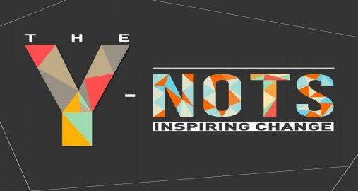

# WitsTurks2020

WitsTurks is a website that is used by labelers which are users and project owners which are project creators.When doing machine learning getting data for labels is often expensive, time consuming and dffcult but WITS TURKS you will be able to distribute it to as many people as possible so that people can do it for you. A user will be able to login to the website allowing them to create projects or label already create projects(with different types of labels)and the system will capture all that. With this users will spend less time trying to get data for labels.


|Release|Build        |Test    |
|-------|-------------|-------:|
| |[](https://circleci.com/gh/Y-Nots2020)|[](https://coveralls.io/github/Y-Nots2020/WitsTurks2020?branch=master)|

## Table of Contents
* [Tutor-Tracker](#tutor-tracker)
* [Installation](#installation)
* [Usage](#usage)
* [Framework Used](#framework-used)

## Installation
On Linux
```bash
$ git clone https://github.com/Y-Nots2020/WitsTurks2020.git
$ cd WitsTurks2020
```

## Usage

## Framework Used
